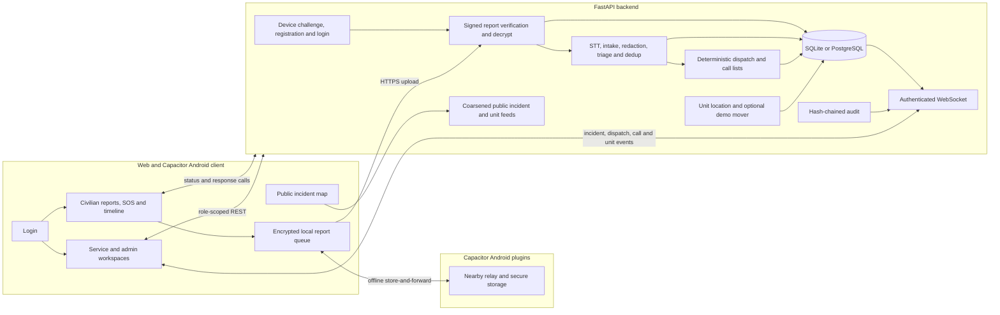

<div align="center">

# Sahay | സഹായ് | सहाय | சஹாய் 


**A civic incident reporting and response prototype for unreliable network conditions.**

Encrypted reporting · Agent-assisted triage · Deterministic dispatch · Android relay

[Overview](#overview) · [Quick Start](#quick-start) · [Architecture](#architecture) · [Features](#features) · [Project Structure](#project-structure) · [Development](#development) · [API Reference](#api-reference) · [Documentation](#documentation)

</div>

---

## Overview

Sahay combines an encrypted report ingest API, an agent pipeline for transcription, intake, redaction and triage, deterministic nearest-unit dispatch, role-scoped dashboards, and an Android relay protocol. The web client and Capacitor Android app connect to the backend; Android can queue and relay encrypted reports when direct connectivity is unavailable.

### What's Included

| Component | Description |
|---|---|
| **Civilian reporting** | Encrypted audio/text reports, location capture, offline retry queue, status and response-call timeline |
| **Android app** | Capacitor app with secure device-key storage and Nearby relay plugins |
| **Backend API** | FastAPI device auth, report ingest, incident processing, dispatch, audit, and live updates |
| **Agent pipeline** | Configurable STT, LLM, PII redaction, search and deterministic fallback modes |
| **Service workspace** | Assigned calls, accept/decline/status actions, location updates and live map |
| **Admin workspace** | Incident review, dispatch approval/reassignment, audit and reason-required PII reveal |
| **Public map** | Confirmed incidents and response units with coarse, non-identifying locations |
| **Relay modules** | Kotlin relay core, Android Nearby transport, foreground service and separate two-phone demo |
| **Docker demo** | Single-origin web and API container with generated local deployment secrets |

---

## Quick Start

### Prerequisites

- Python 3.10 or later and pip
- Node.js and npm
- For standalone native modules: JDK 17, Android SDK, and an Android device for transport/demo execution
- For the Capacitor Android app: Node.js 22, JDK 21, Android SDK platform 36, and `adb`

### Run Locally

#### Backend

From `backend/` (PowerShell):

```powershell
python -m venv .venv
.venv\Scripts\Activate.ps1
pip install -r requirements.txt
Copy-Item .env.example .env
$env:SAHAY_DEV = "1"
uvicorn app.main:app --reload
```

The API is available at `http://localhost:8000` and the OpenAPI UI at `http://localhost:8000/docs`. Development credentials are configured by the backend demo seed; see [backend/README.md](backend/README.md). Do not use development credentials outside local development.

#### Web

From `web/`:

```powershell
npm ci
Copy-Item .env.example .env.local
npm run dev
```

Vite serves the app at `http://localhost:3000`. The API and WebSocket defaults target the local backend. For Android, `VITE_API_BASE` and `VITE_WS_URL` are embedded at build time. On Linux, use `npm install` if the checked-in lockfile's optional entries prevent `npm ci` from completing.

#### Android app

From `web/`:

```powershell
npm install
npm run build:app
npx cap sync android
cd android
.\gradlew.bat assembleDebug
```

See [web/android/README.md](web/android/README.md) for device installation, backend URL configuration, and two-phone relay testing.

#### Docker demo

From the repository root:

```powershell
python deploy/gen_secrets.py
docker compose up --build -d
```

Open `http://localhost:8080`. The demo serves the web app and API from one origin and should run as a single backend instance because WebSocket and device-challenge state is process-local. See [deploy/README.md](deploy/README.md) for tunnel and Android configuration.

### Services

| Service | Port | Purpose |
|---|---:|---|
| `sahay` | `8080` (host) / `8000` (container) | Combined web app and FastAPI backend in Docker |
| Vite dev server | `3000` | Local web development server |
| FastAPI | `8000` | Local API and OpenAPI UI |
| Native relay modules | — | Kotlin relay protocol and Android transport; built with the Gradle wrapper |

---

## Architecture

The system connects civilian, service, admin, and public web views to the FastAPI backend. Android adds secure storage and Nearby store-and-forward for encrypted envelopes. Public map feeds expose coarse, non-identifying data. The optional demo mover simulates unit movement.



### Data and configuration

| Area | Details |
|---|---|
| **Report protection** | Client encrypts to the server X25519 public key and signs with its device Ed25519 key; server verifies, decrypts, validates, and returns a signed receipt |
| **Persistence** | SQLAlchemy with SQLite by default or PostgreSQL via `SAHAY_DATABASE_URL` |
| **Web configuration** | `VITE_API_BASE` and `VITE_WS_URL`; Supabase scaffolding uses `VITE_SUPABASE_URL` and `VITE_SUPABASE_PUBLISHABLE_KEY` only if invoked |
| **Secrets** | Backend secret settings are documented in `backend/.env.example`; keep actual values in ignored local environment files |
| **Android build** | `VITE_API_BASE` and `VITE_WS_URL` are baked into the app at `npm run build:app` time |

---

## Features

| Feature | Description |
|---|---|
| **Device auth** | Challenge-based device registration and JWT-based civilian, service, and admin roles |
| **Encrypted reports** | Signed encrypted report envelopes with audio/text and location, local retry queue, signed receipts, and report status |
| **Offline relay** | Android Nearby forwarding with deduplication, TTL/hops, store-and-forward, and receipt/status return paths |
| **SOS** | Hold-for-two-seconds SOS reporting for a civilian who cannot describe the incident |
| **Agent pipeline** | Speech-to-text, structured intake, PII redaction, triage, deduplication, and trace records; mock modes and rule fallbacks support offline development |
| **Dispatch** | Deterministic nearest-unit selection and ETA, ordered service calls, admin approval/reassignment, and service accept/decline/progress actions |
| **Live response** | Unit location updates and optional demo auto-accept, call timeout, movement, and arrival behavior |
| **Dashboards and maps** | Connected civilian, service and admin workspaces plus a public map with coarse, non-identifying incident and unit locations |
| **Privacy and audit** | Encrypted sensitive incident fields, redacted service views, reason-required audited admin PII reveal, and hash-chained audit verification |
| **Live events** | Authenticated role-scoped WebSocket updates for incidents, dispatches, calls, traces, audits, report status, and unit movement |

---

## Project Structure

```text
Sahay/
├── backend/
│   ├── app/                 # FastAPI API, auth, persistence, agents, dispatch, audit, ingest
│   ├── tests/               # pytest backend tests
│   ├── requirements.txt     # Python dependencies
│   └── .env.example         # Backend configuration template
├── web/
│   ├── src/routes/          # TanStack file routes
│   ├── src/components/      # Citizen and operations screens, shared UI primitives
│   ├── src/integrations/    # Supabase client/auth scaffolding
│   ├── src/lib/report/      # Encrypted reports, offline queue, relay, and upload
│   ├── src/native/          # Capacitor plugin interfaces
│   ├── android/             # Capacitor Android app and native plugins
│   ├── drizzle/             # Drizzle schema and migration
│   ├── scripts/             # Static Android app build
│   ├── package.json         # Scripts and JavaScript dependencies
│   └── .env.example         # Vite API/WebSocket URL template
├── native/
│   ├── relay-core/          # Pure Kotlin relay protocol and storage engine
│   ├── relay-android/       # Android Nearby Connections transport
│   └── relay-demo/          # Android two-phone relay demo
├── spikes/nearby/           # Earlier Nearby transport experiment
├── contract/                # Shared JSON fixtures and crypto test vector
├── docs/                    # API contract, diagram, issues, and project notes
├── deploy/                  # Docker demo setup and secret generator
├── Dockerfile               # Combined web SPA and FastAPI image
├── docker-compose.yml
└── CONTRIBUTING.md
```

---

## Development

### Environment variables

Copy `backend/.env.example` to `backend/.env` and `web/.env.example` to `web/.env.local`. The following variables control common runtime behavior; provider credentials and all defaults are listed in the example files.

| Variable | Purpose |
|---|---|
| `SAHAY_DEV` | Enables local demo credentials and `/api/v1/dev/*` routes |
| `SAHAY_JWT_SECRET` | JWT signing secret; required when development mode is disabled |
| `SAHAY_DATABASE_URL` | SQLite or PostgreSQL database connection |
| `SAHAY_CORS_ORIGINS` | Allowed browser origins |
| `SAHAY_SERVER_X25519_SECRET_KEY` | Server report-decryption key in deployed configuration |
| `SAHAY_SERVER_ED25519_SECRET_KEY` | Server receipt-signing key in deployed configuration |
| `SAHAY_PII_ENCRYPTION_KEY` | Encryption key for sensitive incident fields in deployed configuration |
| `SAHAY_RATE_LIMIT_PER_MINUTE` | General authenticated API and WebSocket connection limit |
| `SAHAY_REGISTER_RATE_LIMIT_PER_MINUTE` | Device registration rate limit |
| `SAHAY_LOGIN_RATE_LIMIT_PER_MINUTE` | Login rate limit |
| `SAHAY_PIPELINE_AUTORUN` | Controls automatic pipeline processing after report acceptance |
| `SAHAY_WS_AUTH_TIMEOUT_S` | Time allowed for the initial WebSocket authentication message |
| `SAHAY_DEMO_MOVER` | Enables the optional simulated unit mover |
| `SAHAY_DEMO_ARRIVAL_SECONDS` | Demo mover arrival duration |
| `SAHAY_DEMO_AUTO_ACCEPT_SECONDS` | Optional delay before demo calls are auto-accepted |
| `SAHAY_DEMO_AUTO_COMPLETE_SECONDS` | Optional delay before demo calls are auto-completed |
| `SAHAY_CALL_TIMEOUT_S` | Optional delay before an unanswered call is skipped |
| `SAHAY_SEED_ADMIN_PASSWORD`, `SAHAY_SEED_SERVICE_PASSWORD` | Optional staff account seed values for an empty deployed database |
| `SAHAY_STT_MODE`, `SAHAY_STT_PROVIDERS` | Selects mock/live speech recognition and provider order |
| `SAHAY_LLM_MODE`, `LLM_PROVIDER`, `LLM_API_KEY` | Selects mock/live LLM and provider credentials |
| `SAHAY_SEARCH_MODE`, `SAHAY_WEB_SEARCH_KEY` | Selects mock/live hazard-context search |
| `VITE_API_BASE`, `VITE_WS_URL` | Browser API and WebSocket URLs; also embedded in Android builds |
| `VITE_SUPABASE_URL`, `VITE_SUPABASE_PUBLISHABLE_KEY` | Optional Supabase client scaffolding configuration |

Never put actual secrets in the README or frontend environment file. Use placeholders such as `your_api_key_here` in examples and store real values only in local ignored environment files or a secrets manager.

### Backend

Install the project dependencies and run the test suite:

```powershell
cd backend
python -m venv .venv
.venv\Scripts\Activate.ps1
pip install -r requirements.txt
pytest
```

`backend/pytest.ini` configures the backend test suite. Optional live STT, LLM, and search integrations require the provider settings described in `backend/.env.example`; mock modes do not require provider credentials.

### Frontend

To work on the frontend independently:

```powershell
cd web
npm ci
npm run dev
```

The Vite development server uses port 3000. Available scripts include:

| Command | Purpose |
|---|---|
| `npm run dev` | Start the web development server |
| `npm test` | Run Vitest once |
| `npm run test:watch` | Run Vitest interactively |
| `npm run lint` | Run ESLint |
| `npm run build` | Build the web application |
| `npm run build:app` | Build a static SPA for the Capacitor Android app |
| `npm run format` | Apply Prettier formatting |

On Linux, use `npm install` if `npm ci` fails due to missing optional lockfile entries. See [web/README.md](web/README.md) and [web/android/README.md](web/android/README.md) for app-specific guidance.

### Native relay

From `native/` using the Gradle wrapper:

```powershell
.\gradlew.bat :relay-core:test
.\gradlew.bat :relay-demo:assembleDebug
```

The pure JVM relay core can be tested without a phone. Android transport and demo execution require an installed Android SDK and device. See [native/README.md](native/README.md) for details.

---

## API Reference

Base REST path: `/api/v1`. Authenticated endpoints use `Authorization: Bearer <token>`. Full request/response schemas and the shared relay protocol are documented in [docs/api-contract.md](docs/api-contract.md); generated OpenAPI is available at `/docs` while the backend runs.

| Method | Endpoint | Access / purpose |
|---|---|---|
| `GET` | `/health` | Health status |
| `GET` | `/api/v1/config/server-key` | Public server encryption and receipt-verification keys |
| `POST` | `/api/v1/auth/device-challenge` | Issue a device registration challenge |
| `POST` | `/api/v1/auth/register-device` | Register device key and obtain civilian token |
| `POST` | `/api/v1/auth/login` | Service/admin login |
| `POST` | `/api/v1/reports` | Submit a signed encrypted report |
| `GET` | `/api/v1/reports/mine` | List the caller's reports |
| `GET` | `/api/v1/reports/{report_id}/status` | Get own report status |
| `GET` | `/api/v1/reports/{report_id}/calls` | Get civilian response-call timeline |
| `GET` | `/api/v1/incidents` | List role-visible incidents |
| `GET` | `/api/v1/incidents/{id}` | Get role-visible incident details |
| `GET` | `/api/v1/incidents/{id}/calls` | Get incident call lists |
| `GET` | `/api/v1/incidents/{id}/trace` | Admin agent trace |
| `POST` | `/api/v1/incidents/{id}/reveal` | Admin reason-required PII reveal |
| `PATCH` | `/api/v1/units/{id}/location` | Report service unit location |
| `GET` | `/api/v1/public/incidents` | Public coarse incident map feed |
| `GET` | `/api/v1/public/units` | Public response-unit map feed |
| `GET`, `POST` | `/api/v1/audit`, `/api/v1/audit/verify` | Admin audit listing and verification |
| `WS` | `/ws/v1` | Authenticated role-scoped live events |

For WebSocket authentication, connect to `/ws/v1`, then send `{"type":"auth","token":"<jwt>"}` as the first message. The token is not passed in the URL. With `SAHAY_DEV=1`, local workflow endpoints include `/api/v1/dev/seed`, `/reset`, `/mock-report`, `/tick`, and `/status`.

---

## Documentation

- [Backend README](backend/README.md): local development, demo setup, auth, keys, and incident privacy
- [Web README](web/README.md): web scripts, routes, and frontend configuration
- [Android README](web/android/README.md): Capacitor build, device setup, and relay testing
- [Native README](native/README.md): relay protocol, JVM tests, and two-phone demo
- [API contract](docs/api-contract.md): REST, WebSocket, envelope, and Nearby contracts
- [Docker demo](deploy/README.md): one-origin Docker setup and tunnel configuration
- [Third-party notices](docs/third-party.md): dependency disclosures
- [Contributing](CONTRIBUTING.md): repository workflow
