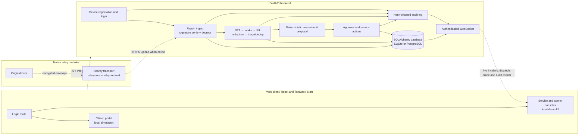

# Sahay

Sahay is a civic incident reporting and response prototype designed for unreliable network conditions. It combines an encrypted report ingest API, an agent pipeline for transcription/intake/redaction/triage, deterministic nearest-unit dispatch, role-scoped dashboards, and an Android relay protocol. The web citizen flow currently presents a local simulation; the backend and the separate Kotlin relay modules implement independently testable API and transport pieces.

## Architecture and tech stack

- **Web:** TypeScript, React 19, TanStack Start/Router, Vite, Tailwind CSS 4, Radix UI-based components, Lucide icons, Framer Motion, React Query, Zod, Supabase JS integration scaffolding.
- **Backend:** Python 3.10+ (type hints), FastAPI, Pydantic Settings, SQLAlchemy, SQLite by default or PostgreSQL via psycopg, PyNaCl (sealed-box encryption and Ed25519 signatures), JWT via python-jose.
- **Agents:** pluggable speech-to-text, LLM, PII and search components; deterministic mock modes are configured by default. Dispatch selection/ETA is code-based.
- **Android relay:** Kotlin/JVM 17, Kotlin serialization, Google Nearby Connections in the Android transport module. The relay is separate from the web app; there is no Capacitor Android project in this repository yet.
- **Checks:** Vitest, Testing Library, ESLint, pytest, Gradle/JUnit.

## System architecture / flow

The solid path shows implemented backend processing. Dashed arrows mark the separately implemented native relay or the web demo simulation; the current citizen UI does not submit to the API.



## Key features

- Device-bound report registration and JWT-based civilian, service, and admin roles.
- Signed encrypted report envelopes: clients encrypt to the server X25519 key; the API verifies device Ed25519 signatures, decrypts and validates payloads, and returns signed receipts.
- Agent pipeline with speech-to-text, structured intake, PII redaction, triage, deduplication, and trace records. Mock modes support offline development; failed agent steps can use rule-based fallbacks.
- Deterministic nearest available unit selection and ETA calculation, with admin approval controls and service accept/decline/progress actions.
- Encrypted storage for sensitive incident fields, redacted service views, and reason-required, audit-logged admin PII reveal.
- Hash-chained audit entries with an admin verification endpoint.
- Authenticated role-scoped WebSocket events.
- Kotlin relay core for opaque envelope forwarding, deduplication, TTL/hops, store-and-forward, and receipt/status return paths. Android transport and a two-phone demo are provided separately.
- Web routes for login, citizen, service, and admin experiences. The citizen dispatch interaction is explicitly a simulation and is not connected to the FastAPI API.

## Directory structure

```text
Sahay/
├── backend/
│   ├── app/                 # FastAPI API, auth, persistence, agents, dispatch, audit, ingest
│   ├── tests/               # pytest backend tests
│   ├── requirements.txt     # Python dependencies
│   └── .env.example         # backend configuration template
├── web/
│   ├── src/routes/          # TanStack file routes
│   ├── src/components/      # Citizen and operations screens, shared UI primitives
│   ├── src/integrations/    # Supabase client/auth scaffolding
│   ├── src/lib/             # Dispatch demo helpers and utilities
│   ├── drizzle/             # Drizzle schema and migration
│   ├── package.json         # scripts and JS dependencies
│   └── .env.example         # Vite API/WebSocket URL template
├── native/
│   ├── relay-core/          # Pure Kotlin relay protocol and storage engine
│   ├── relay-android/       # Android Nearby Connections transport
│   └── relay-demo/          # Android two-phone relay demo
├── spikes/nearby/           # Earlier Nearby transport experiment
├── contract/                # Shared JSON fixtures and crypto test vector
├── docs/                    # API contract, diagram, issues, and project notes
└── CONTRIBUTING.md
```

## Getting started

### Prerequisites

- Python 3.10 or later and pip.
- Node.js and npm (the checked-in frontend lockfile is `package-lock.json`).
- For native modules: JDK 17, Android SDK/`ANDROID_HOME`, and an Android device for transport/demo execution.

### Backend

From `Sahay/backend` (PowerShell):

```powershell
python -m venv .venv
.venv\Scripts\Activate.ps1
pip install -r requirements.txt
Copy-Item .env.example .env
$env:SAHAY_DEV = "1"
uvicorn app.main:app --reload
```

The API is at `http://localhost:8000`; OpenAPI UI is at `http://localhost:8000/docs`. The backend README documents demo credentials and key behavior. `SAHAY_DEV=1` enables demo credentials and `/api/v1/dev/*` endpoints. Defaults use SQLite (`sahay.db`) and mock STT/LLM modes. For a deployed configuration, set a unique `SAHAY_JWT_SECRET`, `SAHAY_PII_ENCRYPTION_KEY`, and server X25519/Ed25519 secret keys; configure `SAHAY_DATABASE_URL` and `SAHAY_CORS_ORIGINS` as needed. Keep generated local key files with the local database.

Optional external speech/LLM providers require their provider settings and credentials described in `backend/.env.example`; mock mode does not require network credentials.

### Web

From `Sahay/web`:

```powershell
npm ci
Copy-Item .env.example .env.local
npm run dev
```

Vite serves the app locally (normally at `http://localhost:5173`). `.env.example` defines `VITE_API_BASE` and `VITE_WS_URL`, but the current citizen and operations screens are demo UI and do not yet use those API endpoints. The Supabase client integration is separate scaffolding and requires `VITE_SUPABASE_URL` and `VITE_SUPABASE_PUBLISHABLE_KEY` if it is invoked.

### Native relay

From `Sahay/native` using the Gradle wrapper:

```powershell
.\gradlew.bat :relay-core:test
.\gradlew.bat :relay-demo:assembleDebug
```

The Android modules require an installed/configured Android SDK. See [native/README.md](native/README.md) for device install and two-phone demo steps. The repository does not include the Capacitor wrapper/plugin or a generated Android project.

## API reference / usage

Base REST path: `/api/v1`. Authenticated endpoints use `Authorization: Bearer <token>`. Full request/response schemas and the shared relay protocol are documented in [docs/api-contract.md](docs/api-contract.md); generated OpenAPI is available at `/docs` while the backend runs.

Primary implemented endpoints:

- `GET /health`, `GET /api/v1/config/server-key`
- `POST /api/v1/auth/register-device`, `POST /api/v1/auth/login`
- `POST /api/v1/reports`, `GET /api/v1/reports/mine`, `GET /api/v1/reports/{report_id}/status`
- `GET /api/v1/incidents`, `GET /api/v1/incidents/{id}`, `GET /api/v1/incidents/{id}/trace`, `POST /api/v1/incidents/{id}/reveal`
- Admin dispatch controls: incident approve/reject/reassign; service dispatch list, accept/decline, and status updates.
- Admin audit: `GET /api/v1/audit`, `GET /api/v1/audit/verify`; admin unit listing: `GET /api/v1/units`.
- `WS /ws/v1?token=<jwt>` for authenticated live events (including incident, dispatch, trace, audit, and report status events).
- With `SAHAY_DEV=1`: `/api/v1/dev/seed`, `/reset`, `/mock-report`, `/tick`, and `/status` for local demo workflows.

## Testing and linting

Run checks from the relevant project directory:

```powershell
# Web
cd web
npm test
npm run lint
npm run build

# Backend
cd ..\backend
pytest

# Pure JVM relay
cd ..\native
.\gradlew.bat :relay-core:test
```

`npm run test:watch` runs Vitest interactively. `npm run format` applies Prettier formatting across the web project. The backend test suite is configured by `backend/pytest.ini`.
