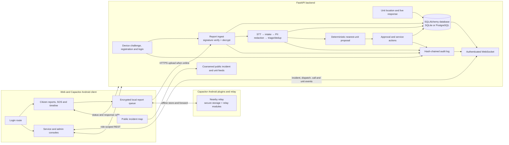

# Sahay | സഹായ് | सहाय | சஹாய் 

Sahay is a civic incident reporting and response prototype designed for unreliable network conditions. It combines an encrypted report ingest API, an agent pipeline for transcription/intake/redaction/triage, deterministic nearest-unit dispatch, role-scoped dashboards, and an Android relay protocol. The web client and Capacitor Android app connect to the backend; Android can queue and relay encrypted reports when direct connectivity is unavailable.

## Architecture and tech stack

- **Web:** TypeScript, React 19, TanStack Start/Router, Vite, Tailwind CSS 4, Radix UI-based components, Lucide icons, Framer Motion, React Query, Zod, Leaflet maps, libsodium client encryption, and Capacitor 8 for Android.
- **Backend:** Python 3.10+ (type hints), FastAPI, Pydantic Settings, SQLAlchemy, SQLite by default or PostgreSQL via psycopg, PyNaCl (sealed-box encryption and Ed25519 signatures), JWT via python-jose.
- **Agents:** pluggable speech-to-text, LLM, PII and search components; deterministic mock modes are configured by default. Dispatch selection/ETA is code-based.
- **Android relay:** Capacitor 8 app with native secure-storage and Nearby plugins, backed by separate Kotlin/JVM 17 relay-core and Android transport modules using Kotlin serialization and Google Nearby Connections.
- **Checks:** Vitest, Testing Library, ESLint, pytest, Gradle/JUnit.

## System architecture / flow

The diagram shows the connected web/Android clients and backend flows. Android Nearby relay forwards opaque encrypted envelopes when a report cannot upload directly; the optional demo mover simulates unit movement.



## Key features

- Device-bound report registration and JWT-based civilian, service, and admin roles.
- Signed encrypted report envelopes: clients encrypt to the server X25519 key; the API verifies device Ed25519 signatures, decrypts and validates payloads, and returns signed receipts.
- Agent pipeline with speech-to-text, structured intake, PII redaction, triage, deduplication, and trace records. Mock modes support offline development; failed agent steps can use rule-based fallbacks.
- Deterministic nearest available unit selection and ETA calculation, with admin approval controls and service accept/decline/progress actions.
- Encrypted storage for sensitive incident fields, redacted service views, and reason-required, audit-logged admin PII reveal.
- Hash-chained audit entries with an admin verification endpoint.
- Authenticated role-scoped WebSocket events.
- Civilian encrypted report submission with audio/text and location, an offline retry queue, signed receipts, report status, and response-call timelines.
- Hold-for-two-seconds SOS reporting and Android Nearby relay with opaque envelope forwarding, deduplication, TTL/hops, store-and-forward, and receipt/status return paths. The Android app includes secure device-key storage and a foreground relay service; a separate two-phone relay demo is also provided.
- Connected service and admin workspaces for dispatch actions, incident review, live call timelines, and moving-unit updates. The public map shows confirmed incidents and response units with coarse, non-identifying locations.
- Optional backend demo mover, auto-accept, arrival, and call-timeout settings simulate live unit response for demonstrations.

## Directory structure

```text
Sahay/
├── backend/
│   ├── app/                 # FastAPI API, auth, persistence, agents, dispatch, audit, ingest
│   ├── tests/               # pytest backend tests
│   ├── requirements.txt     # Python dependencies
│   └── .env.example         # backend configuration template
├── web/
│   ├── src/routes/          # TanStack file routes
│   ├── src/components/      # Citizen and operations screens, shared UI primitives
│   ├── src/integrations/    # Supabase client/auth scaffolding
│   ├── src/lib/             # Dispatch demo helpers and utilities
│   ├── src/lib/report/      # Encrypted reports, offline queue, relay, and upload
│   ├── src/native/          # Capacitor plugin interfaces
│   ├── android/             # Capacitor Android app and native plugins
│   ├── drizzle/             # Drizzle schema and migration
│   ├── scripts/             # Static Android app build
│   ├── package.json         # scripts and JS dependencies
│   └── .env.example         # Vite API/WebSocket URL template
├── native/
│   ├── relay-core/          # Pure Kotlin relay protocol and storage engine
│   ├── relay-android/       # Android Nearby Connections transport
│   └── relay-demo/          # Android two-phone relay demo
├── spikes/nearby/           # Earlier Nearby transport experiment
├── contract/                # Shared JSON fixtures and crypto test vector
├── docs/                    # API contract, diagram, issues, and project notes
├── deploy/                  # Docker demo setup and secret generator
├── Dockerfile               # Combined web SPA and FastAPI image
├── docker-compose.yml
└── CONTRIBUTING.md
```

## Getting started

### Prerequisites

- Python 3.10 or later and pip.
- Node.js and npm (the checked-in frontend lockfile is `package-lock.json`).
- For the standalone native modules: JDK 17, Android SDK/`ANDROID_HOME`, and an Android device for transport/demo execution. For the Capacitor Android app: Node.js 22, JDK 21, Android SDK platform 36, and `adb`.

### Backend

From `Sahay/backend` (PowerShell):

```powershell
python -m venv .venv
.venv\Scripts\Activate.ps1
pip install -r requirements.txt
Copy-Item .env.example .env
$env:SAHAY_DEV = "1"
uvicorn app.main:app --reload
```

The API is at `http://localhost:8000`; OpenAPI UI is at `http://localhost:8000/docs`. The backend README documents demo credentials and key behavior. `SAHAY_DEV=1` enables demo credentials and `/api/v1/dev/*` endpoints. Defaults use SQLite (`sahay.db`) and mock STT/LLM modes. For a deployed configuration, set a unique `SAHAY_JWT_SECRET`, `SAHAY_PII_ENCRYPTION_KEY`, and server X25519/Ed25519 secret keys; configure `SAHAY_DATABASE_URL` and `SAHAY_CORS_ORIGINS` as needed. Keep generated local key files with the local database. Optional rate limits are configured with `SAHAY_RATE_LIMIT_PER_MINUTE`, `SAHAY_REGISTER_RATE_LIMIT_PER_MINUTE`, and `SAHAY_LOGIN_RATE_LIMIT_PER_MINUTE`; `SAHAY_PIPELINE_AUTORUN` controls automatic pipeline processing. Demo response behavior can be configured with `SAHAY_DEMO_MOVER`, `SAHAY_DEMO_ARRIVAL_SECONDS`, `SAHAY_DEMO_AUTO_ACCEPT_SECONDS`, `SAHAY_DEMO_AUTO_COMPLETE_SECONDS`, and `SAHAY_CALL_TIMEOUT_S`. `SAHAY_WS_AUTH_TIMEOUT_S` sets the time allowed for the WebSocket's first authentication message. `SAHAY_SEED_ADMIN_PASSWORD` and `SAHAY_SEED_SERVICE_PASSWORD` optionally seed staff accounts in an empty deployed database.

Optional external speech/LLM providers require their provider settings and credentials described in `backend/.env.example`; mock mode does not require network credentials.

### Web

From `Sahay/web`:

```powershell
npm ci
Copy-Item .env.example .env.local
npm run dev
```

Vite serves the app locally (`npm run dev` in `web/`, at `http://localhost:3000`). `.env.example` defines `VITE_API_BASE` and `VITE_WS_URL` for API and live WebSocket updates. The Supabase client integration is separate scaffolding and requires `VITE_SUPABASE_URL` and `VITE_SUPABASE_PUBLISHABLE_KEY` if it is invoked. `VITE_API_BASE` and `VITE_WS_URL` are baked into Android builds at build time.

### Native relay

From `Sahay/native` using the Gradle wrapper:

```powershell
.\gradlew.bat :relay-core:test
.\gradlew.bat :relay-demo:assembleDebug
```

The standalone Android modules require an installed/configured Android SDK. See [native/README.md](native/README.md) for the relay protocol and two-phone demo steps. The Capacitor Android app requires Node.js 22, JDK 21, Android SDK platform 36, and `adb`; from `web/`, build and sync it with `npm run build:app` and `npx cap sync android`, then run `.\gradlew.bat assembleDebug` from `web/android/`. See [web/android/README.md](web/android/README.md) for device installation and relay testing. On Linux, use `npm install` if `npm ci` fails due to missing optional lockfile entries.

### Docker demo

From the repository root, generate deployment secrets with `python deploy/gen_secrets.py`, then run `docker compose up --build -d`. The combined web app and API are available at `http://localhost:8080`. The demo uses one backend instance because WebSocket and device-challenge state is process-local. See [deploy/README.md](deploy/README.md) for tunnel and Android configuration.

## API reference / usage

Base REST path: `/api/v1`. Authenticated endpoints use `Authorization: Bearer <token>`. Full request/response schemas and the shared relay protocol are documented in [docs/api-contract.md](docs/api-contract.md); generated OpenAPI is available at `/docs` while the backend runs.

Primary implemented endpoints:

- `GET /health`, `GET /api/v1/config/server-key`
- `POST /api/v1/auth/device-challenge`, `POST /api/v1/auth/register-device`, `POST /api/v1/auth/login`
- `POST /api/v1/reports`, `GET /api/v1/reports/mine`, `GET /api/v1/reports/{report_id}/status`, `GET /api/v1/reports/{report_id}/calls`
- `GET /api/v1/incidents`, `GET /api/v1/incidents/{id}`, `GET /api/v1/incidents/{id}/calls`, `GET /api/v1/incidents/{id}/trace`, `POST /api/v1/incidents/{id}/reveal`
- `PATCH /api/v1/units/{id}/location`; public map feeds: `GET /api/v1/public/incidents`, `GET /api/v1/public/units`.
- Admin dispatch controls: incident approve/reject/reassign; service dispatch list, accept/decline, and status updates.
- Admin audit: `GET /api/v1/audit`, `GET /api/v1/audit/verify`; admin unit listing: `GET /api/v1/units`.
- `WS /ws/v1` for authenticated live events. Send `{"type":"auth","token":"<jwt>"}` as the first message after connecting; events include incident, dispatch, call, trace, audit, report status, and unit movement updates.
- With `SAHAY_DEV=1`: `/api/v1/dev/seed`, `/reset`, `/mock-report`, `/tick`, and `/status` for local demo workflows.

## Testing and linting

Run checks from the relevant project directory:

```powershell
# Web
cd web
npm test
npm run lint
npm run build

# Backend
cd ..\backend
pytest

# Pure JVM relay
cd ..\native
.\gradlew.bat :relay-core:test
```

`npm run test:watch` runs Vitest interactively. `npm run format` applies Prettier formatting across the web project. The backend test suite is configured by `backend/pytest.ini`.
